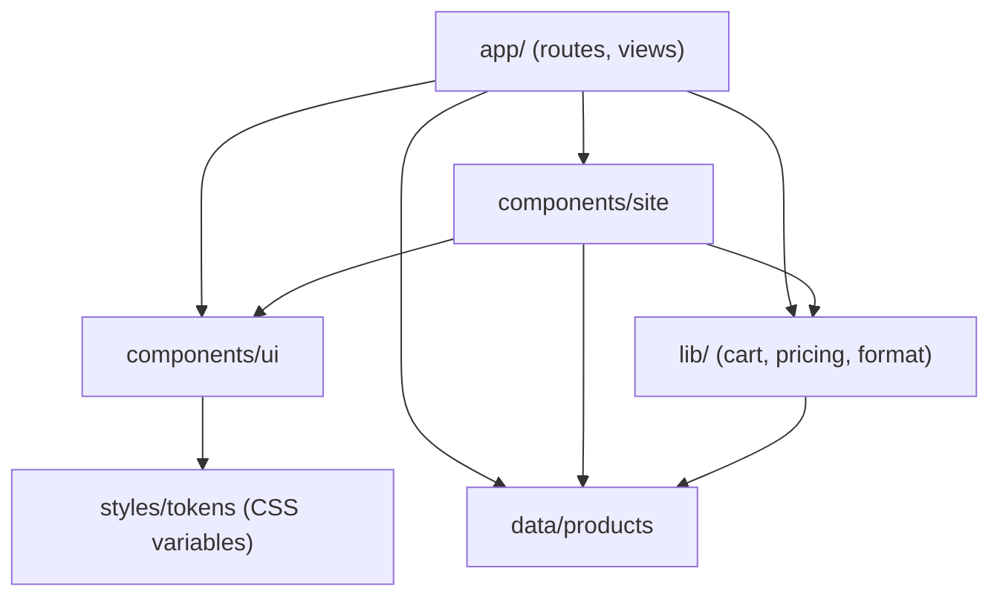

# Architecture

How the Hari Matcha website is put together, and where to change things.
**Related:** [PRD.md](PRD.md) · [Design.md](Design.md) · [README.md](README.md)

## Stack

| | |
|---|---|
| Framework | Next.js 16 (App Router), React 19, TypeScript (strict) |
| Styling | CSS Modules + global CSS custom properties (design tokens). No Tailwind, no CSS-in-JS. |
| Fonts | `next/font/google`: Bagel Fat One, Jost (400/500/600), Tiro Devanagari Hindi, self-hosted at build time |
| Icons | `lucide-react`, wrapped by `Icon` |
| State | React Context (cart), URL query string (shop filters), local `useState` (product page) |
| Data | Static TypeScript module ([src/data/products.ts](src/data/products.ts)) |
| Hosting | Vercel, "Next.js" preset, no environment variables |

There is no backend, database or API route. Every page is generated at build time.

## Layout of the repo

```
design/                 Design handoff (source of truth for visuals and copy). Not compiled; excluded in tsconfig.
src/
  app/                  Routes
    layout.tsx          Root layout: fonts, metadata, CartProvider, header, footer, cart drawer
    globals.css         Imports tokens, container, utilities, reduced-motion rule
    page.tsx            Home (server component)
    GradeTable.tsx      Home grade table (client: navigation + add to cart)
    shop/               /shop: page.tsx (server) + ShopView.tsx (client)
    products/[slug]/    /products/:slug: page.tsx (server, static params) + ProductView.tsx (client)
    not-found.tsx       404
  components/
    ui/                 Design-system components. Only read tokens. No knowledge of products or cart.
    site/               Site-specific pieces: SiteHeader, SiteFooter, CartDrawer, ProductTile, Placeholder
  data/products.ts      Placeholder catalogue + access helpers
  lib/
    cart.tsx            Cart context and localStorage persistence
    pricing.ts          Business constants (subscription discount, free-shipping threshold)
    format.ts           ₹ formatting
  styles/tokens/        Design tokens, ported from design/tokens
```

The import path alias `@/*` points to `src/*`.

### Dependency direction



`components/ui` must stay generic: it depends on nothing but tokens and `Icon`. That way it can move into a separate package later.

## Rendering

| Route | Server part | Client part | Output |
|---|---|---|---|
| `/` | `page.tsx` reads products, renders hero and promo | `GradeTable` (row click, add) | Static |
| `/shop` | `page.tsx` sets metadata, wraps the view in `Suspense` | `ShopView` reads `useSearchParams` | Static. The fallback renders the unfiltered list into HTML; the URL filters apply after hydration. |
| `/products/[slug]` | `generateStaticParams` over all products, `dynamicParams = false`, per-product metadata | `ProductView` (size, plan, qty, gift, pincode) | One static page per product; unknown slugs return 404 |
| global | `layout.tsx` | `CartProvider`, `SiteHeader` (mobile menu, cart count), `CartDrawer` | — |

The rule of thumb is **server by default; `'use client'` only on the component that needs state or browser APIs**, and keep that component as low in the tree as possible.

## State

### Cart: [src/lib/cart.tsx](src/lib/cart.tsx)

- `CartProvider` sits in the root layout. `useCart()` gives you `items`, `count`, `subtotal`, `open`, `setOpen`, `add`, `setQty`, `remove`.
- A line is `{ key, id, name, size, unit, qty }`. The `key` is `slug:size:unitPrice`, so the same product at a subscription price is a separate line.
- `add()` merges matching keys and **always opens the drawer**.
- `setQty(key, n)` with `n < 1` removes the line.
- **Persistence:** saved to `localStorage["hari-cart"]`. It is read in an effect after mount, so the server HTML and the first client render match (an empty cart). Writes start only after that read, so the stored cart is never overwritten with `[]`. If storage is unavailable (for example, private mode), the cart works in memory only.

### Shop filters: [src/app/shop/ShopView.tsx](src/app/shop/ShopView.tsx)

The URL is the state. There's no `useState` for filters.

```
/shop?grade=Everyday,Ceremonial&sort=low&stock=all
```

| Param | Absent | Values |
|---|---|---|
| `grade` | all grades | comma-separated `Grade` names; `grade=` (empty) means none |
| `sort` | `popular` | `low`, `high` |
| `stock` | in stock only | `all` |

Updates call `history.replaceState`. Next.js keeps `useSearchParams` in sync with that, so there's no server round trip and no new history entry for every checkbox.

### Product page

Local `useState` for `size`, `plan`, `qty`, `gift`, `pincode`. The price is derived on every render through `unitPrice()` from [src/lib/pricing.ts](src/lib/pricing.ts). Nothing is stored.

## Data

[src/data/products.ts](src/data/products.ts) exports the `Product` type, `PRODUCTS`, and the helpers `getProducts()`, `getProduct(slug)` and `fromPrice(p)`. **Everything that reads products goes through these helpers.** That's the seam for replacing the placeholder data with Shopify Storefront, Medusa or a CMS:

1. Make `getProducts` / `getProduct` async and fetch from the source.
2. Await them in the server components (`page.tsx` files and `generateStaticParams`).
3. Client components already receive products as props (`ProductView`, `GradeTable`, `ProductTile`). The exception is `ShopView`, which calls `getProducts()` directly: pass the list in from `shop/page.tsx` instead.
4. Choose a revalidation strategy (`revalidate` or on-demand) so price changes appear without a redeploy.

Prices are whole rupees (`number`). Keep it that way, or switch to paise everywhere; don't mix the two.

## Styling

- Tokens are global CSS custom properties, loaded once from `globals.css` in this order: primitives → neutrals → semantic → typography → spacing → components → base. See [Design.md](Design.md) for the layers.
- Each component has a co-located `*.module.css` that reads **only** `var(--…)` tokens. Hover, focus-visible and active are real CSS selectors, not JS state.
- Fonts: `next/font` exposes `--font-bagel-fat-one`, `--font-jost`, `--font-tiro-devanagari` on `<html>`. `tokens/typography.css` maps them onto `--font-display`, `--font-sans`, `--font-devanagari`. This is the one deliberate difference from `design/tokens`, which used a Google Fonts `@import`.
- Breakpoints (plain media queries, no shared variables): **900px** (grids stack, header collapses to a menu, shop filters move to a sheet), **600px** (smaller gutter and display sizes), **480px** (full-width drawer and sheet).
- `--header-offset: 140px` is the height of the sticky announcement bar plus header. Sticky sidebars use it.

## Accessibility

- The custom `Select` is a full listbox: arrows, Home/End, Enter/Space, Esc, Tab, outside click.
- The cart drawer and filter sheet are `role="dialog"` + `aria-modal`. They move focus to the close button on open, close on Esc, lock body scroll, and are `inert` when closed. The drawer returns focus to the trigger.
- Live regions announce product counts and price totals.
- `prefers-reduced-motion` reduces all transitions to near zero.

## Known gaps and where they go

| Gap | Where to start |
|---|---|
| Checkout | `CartDrawer.tsx` (stub button). Add an API route or server action that creates a Razorpay order or a Shopify checkout from `items`. This adds the first environment variables. |
| Gift wrap not sent | `ProductView.tsx` keeps `gift` locally. Add it to `CartItem` (and to the key) when checkout exists. |
| Newsletter | `SiteFooter.tsx`. Post to a provider from a server action. |
| Real images | Replace `Placeholder` with `next/image` and add `images.remotePatterns` in `next.config.ts`. |
| Search, account, help pages | Header icons and footer links have no destination yet (`TODO`s). |
| Tests and CI | None yet. `npm run lint` only type-checks. Start with unit tests for `pricing.ts`, the cart reducer logic and the shop URL `parse`/`serialize`. |
| Analytics | None. Needed for the success measures in [PRD.md](PRD.md). |
