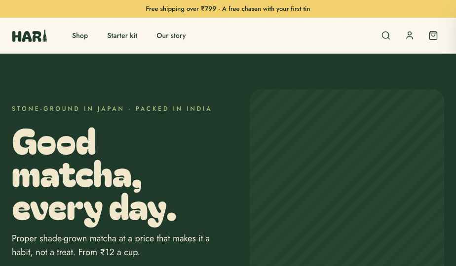
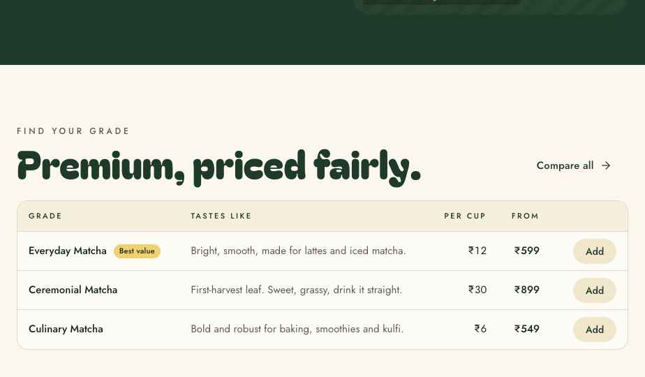
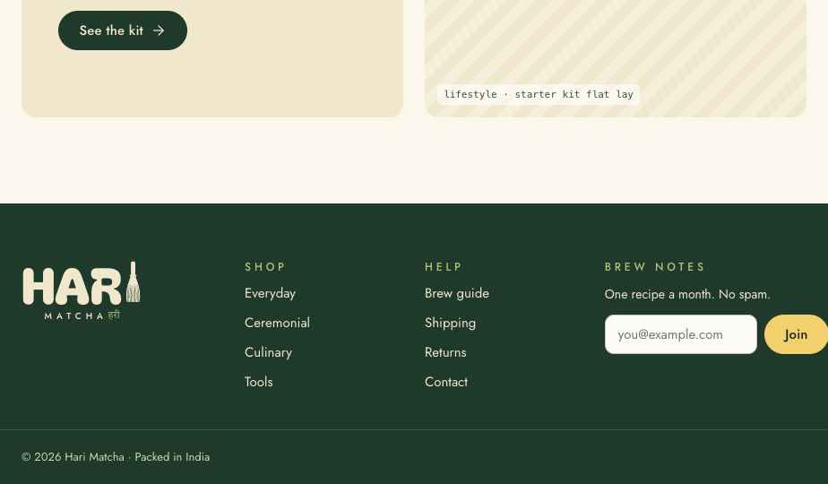
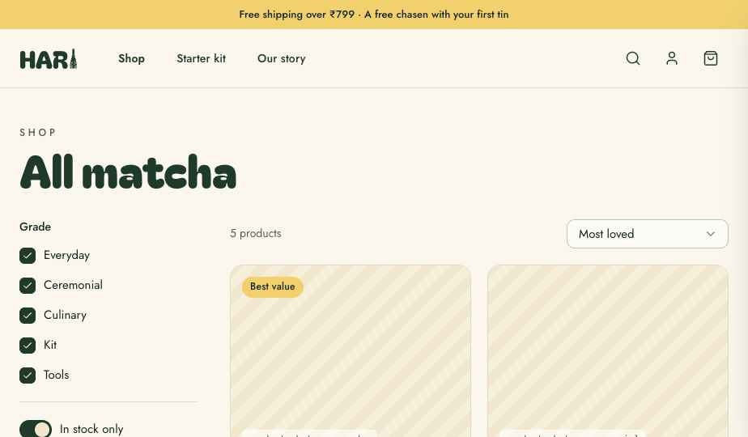
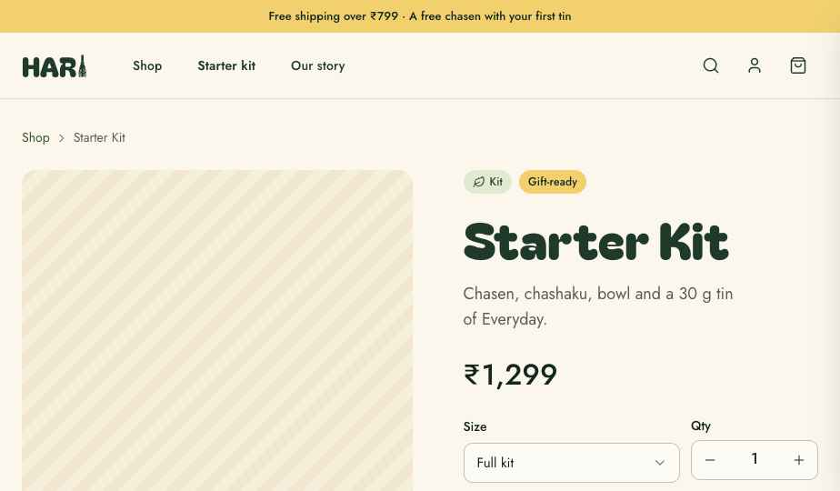
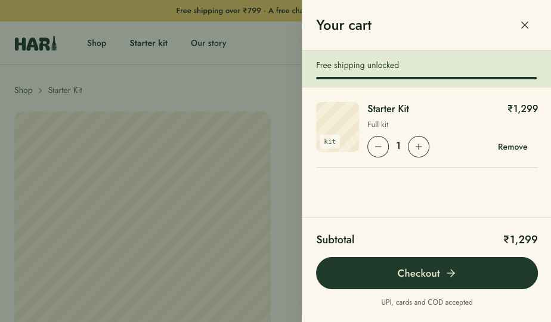

# Handoff: Hari Matcha — E-commerce Website

## Overview
Hari Matcha is an Indian matcha brand positioned as **premium but affordable**. This bundle specifies the marketing and e-commerce website, which has a home page, a shop listing, a product detail page and a cart drawer. It also includes the full design system: tokens, components and logo.

**Goal for Claude Code:** build this as a production **React** website (recommended: **Next.js App Router + TypeScript**) and deploy it to **Vercel**.

## About the Design Files
The files in this bundle are **design references created in HTML/JSX**. They are prototypes that show the intended look and behavior; they are not production code to copy directly. In particular, `lib/load-components.js` compiles JSX in the browser with Babel. That is a prototype hack and must **not** ship.

The task is to **recreate these designs** in a new Next.js codebase:
- Port `tokens/*.css` as-is into global CSS. They are plain CSS custom properties and are production-ready.
- Re-implement `components/**` as typed React components. The prop contracts are in each `.d.ts` file, and usage notes are in each `.prompt.md` file. The prototype components use inline styles plus state for hover. In production, prefer CSS Modules (or Tailwind mapped to the tokens) with real `:hover`, `:focus-visible` and `:active` selectors. Keep the token names.
- Rebuild the screens in `ui_kits/website/*.jsx` as routes.

## Fidelity
**High-fidelity.** The colours, type, spacing, radii, states and copy are final. Recreate them exactly. The product data, prices and imagery are **placeholders** (see Assets).

## Recommended stack
- Next.js 14+ (App Router), React 18, TypeScript
- `next/font/google` for Bagel Fat One, Jost (400/500/600) and Tiro Devanagari Hindi. Expose them as `--font-display`, `--font-sans` and `--font-devanagari`, replacing the `@import` in `tokens/fonts.css`.
- `lucide-react` for icons, replacing the CDN `Icon` wrapper. Stroke width is 1.75 and the default size is 20.
- Cart state in React Context + `localStorage`. Use Zustand only if it grows.
- Product data in `/data/products.ts` for now, structured so it can be swapped for a headless CMS or commerce backend (Shopify Storefront API, Medusa or similar) later.
- Checkout is out of scope for the design. Stub the "Checkout" button, and later integrate Razorpay or Shopify checkout (UPI, cards and COD are referenced in the copy).
- Deploy on **Vercel**: connect the repo, use the framework preset "Next.js", no env vars needed for v1. Add `next/image` remote patterns when real images arrive.

## Suggested routes
| Route | Screen | Source |
|---|---|---|
| `/` | Home | `ui_kits/website/HomeScreen.jsx` |
| `/shop` | Shop listing (filters via query params `?grade=&sort=`) | `ShopScreen.jsx` |
| `/products/[slug]` | Product detail | `ProductScreen.jsx` |
| global | Header, footer, cart drawer (in root layout) | `Chrome.jsx`, `CartDrawer.jsx` |

## Screenshots
Captured from the prototype at a ~924px preview width. **Desktop design width is 1200px+**, so treat proportions, not this width, as the reference.

| | |
|---|---|
| Home — hero  | Home — grade table  |
| Home — footer  | Shop  |
| Product  | Cart drawer  |

## Screens / Views

### Global — Announcement bar + Header (sticky, `top:0`, z 30)
- **Announcement bar:** `--haldi-300` background, `--matcha-950` text, Jost 500 13px, centred, 8px/16px padding. Copy: "Free shipping over ₹799 · A free chasen with your first tin".
- **Header:** `--surface-page` (#FBF7EC) background, 1px bottom border `--border-subtle` (#DFDACD). The inner container is max 1200px with 24px side padding, 72px tall, flex with a 32px gap.
  - Left: `Logo variant="compact" size={30}` linking to `/`.
  - Nav: ghost `Button size="sm"` items "Shop" (→ /shop), "Starter kit" (→ /products/kit), "Our story" (→ /). The active item is weight 600.
  - Right: `IconButton`s for search, user and shopping-bag. The cart button shows a count badge: a 18px haldi-300 pill, Jost 600 11px, top-right. Clicking the cart opens the drawer.

### Home `/`
1. **Hero:** a full-bleed `--surface-brand` (#1F3A2B) band with `--cream-200` text. Inside the container, 72px vertical padding, a grid of `1.1fr / 1fr` with a 48px gap, centred vertically.
   - Overline (`--matcha-300`): "Stone-ground in Japan · Packed in India"
   - Display-lg (Bagel Fat One 72px / 0.92): "Good matcha, every day."
   - Body-lg (18/1.55, `--cream-100`, max 460px): "Proper shade-grown matcha at a price that makes it a habit, not a treat. From ₹12 a cup."
   - Buttons (12px gap): `accent lg` "Shop matcha" with an arrow-right icon (→ /shop), and `outline lg` with a cream border and cream text, "Get the starter kit" (→ /products/kit).
   - Right: a hero image, 460px tall, 24px radius (placeholder: "whisking matcha in a bowl").
2. **Grade comparison:** 88px top padding. Header row: overline "Find your grade" + display-md (56px) "Premium, priced fairly." in `--text-brand`, and a ghost "Compare all →" button on the right.
   - `Table` with columns Grade (name + accent sm Badge if tagged), Tastes like (secondary text), Per cup (right), From (right, 500), and an Add button (secondary sm). Rows: Everyday, Ceremonial, Culinary. Clicking a row opens the product.
3. **Starter kit promo:** 88px top padding, a 2-column grid with a 24px gap. Left: `Card tone="cream"` with 40px padding — overline "New to matcha?", display-sm (40px) "Everything you need, ₹1,299.", body "Bamboo chasen, scoop, bowl and a tin of Everyday — plus a two-minute brew card.", and a primary "See the kit →" button. Right: a 380px lifestyle image.

### Shop `/shop`
- 48px top padding. Overline "Shop" + display-md "All matcha", with a 36px gap below.
- Grid `220px / 1fr` with a 40px gap.
  - **Sidebar** (sticky, top 140): label "Grade", then Checkboxes for Everyday, Ceremonial, Culinary, Kit and Tools (all on by default), a divider, and a Switch "In stock only".
  - **Main:** a row with "{n} products" (body-sm, secondary) and a `Select size="sm"` 200px wide with the options Most loved, Price: low to high, and Price: high to low. Below it is a product grid of `repeat(auto-fill, minmax(260px,1fr))` with a 20px gap.
- **ProductTile:** an interactive Card with padding 0. The image is 240px, and an optional accent Badge sits top-left at 14px. The body has 20px padding and a 6px gap: overline grade, heading-sm name, body-sm blurb, then a row with the price (18px, 500), "₹X a cup" (13px, secondary), and a secondary sm "+ Add" button. Clicking the tile opens the product; Add adds the first size and opens the drawer.

### Product `/products/[slug]`
- Breadcrumb (14px, secondary): Shop › {name}.
- Grid `1.1fr / 1fr` with a 56px gap.
  - **Gallery:** a 2-column grid with a 12px gap. The main image spans both columns at 520px; below it are two 220px images (texture, in use). All have a 16px radius.
  - **Buy box** (sticky, top 140, 22px gap):
    - Badges: matcha grade badge with a leaf icon, plus an accent badge if tagged.
    - Display-md name and body-lg secondary blurb.
    - Price row: 32px/500 total, a struck-through original when subscribed (18px, muted), and "≈ ₹X a cup".
    - Size `Select` beside a 140px Qty stepper (44px tall, input border/radius, with minus/plus icon buttons).
    - A Card (16px padding) containing the Radios "One-time purchase" and "Subscribe & save 15%" (description "Delivered every 30 days. Skip or cancel anytime.").
    - Switch "Gift wrap with a handwritten note (free)".
    - A full-width `accent lg` button with a shopping-bag icon: "Add to cart · ₹{total}".
    - `Input` "Check delivery" with a map-pin icon and placeholder "6-digit pincode". Validation is `/^\d{6}$/`: on failure the error reads "Pincodes are 6 digits"; on success the helper reads "Arrives in 2–4 days"; the default helper is "We ship across India".
- **Pricing logic:** the subscribe price is `round(base × 0.85)` and the total is unit × qty.

### Cart drawer (global)
- A fixed overlay `--surface-overlay` (rgba(19,38,28,.48)) that fades in over 320ms. The panel is 420px wide on the right with `--surface-page` background and `--shadow-lg`, and slides in from `translateX(100%)` over 320ms with `--ease-out`.
- **Header:** heading-md "Your cart" and a close IconButton (x), with a bottom border.
- **Free-shipping meter:** the threshold is ₹799. Below it, the bar uses haldi-100 background and haldi-900 text with the copy "You're ₹X away from free shipping". At or above it, the bar uses matcha-100 background and matcha-800 text with "Free shipping unlocked". The progress bar is 4px, filled with matcha-900.
- **Line items:** a 72×84 thumbnail (10px radius), name and line total (500), size (13px secondary), outline sm minus/plus stepper (qty 0 removes the item), and a ghost "Remove" button.
- **Empty state:** the whisk mark at 64px and "Your cart is empty."
- **Footer:** Subtotal row (18px/500), a full-width primary lg "Checkout →" (disabled when empty), and a caption "UPI, cards and COD accepted".

### Footer
- `--surface-brand` background, 96px top margin. The grid is `1.3fr 1fr 1fr 1.4fr` with a 40px gap and 64px/40px padding.
  - Column 1: `Logo tone="onDark" size={56} showHindi`.
  - Shop column links: Everyday, Ceremonial, Culinary, Tools.
  - Help column links: Brew guide, Shipping, Returns, Contact. Column overlines use matcha-300.
  - Newsletter column: overline "Brew notes", body-sm "One recipe a month. No spam.", then an Input plus an accent "Join" button. Success shows an accent Badge with a check: "You're on the list".
- Bottom bar: 1px top border at cream with .15 opacity, 13px matcha-200 text, "© 2026 Hari Matcha · Packed in India".

## Interactions & Behavior
- **Buttons:** hover steps the background one shade; press scales to 0.98 and goes one shade darker; focus-visible shows a 3px `--matcha-200` ring. Transitions are 120ms `cubic-bezier(.2,.7,.2,1)`.
- **Inputs:** the border is neutral-300 by default, neutral-400 on hover, and matcha-700 with a 3px matcha-200 ring on focus. The error state uses a mirchi-500 border, a mirchi-100 ring, and helper text in mirchi-700 with an alert icon.
- **Select:** a custom listbox with a 16px radius menu, shadow-lg, 6px padding, and 40px items. Items use matcha-50 on hover and matcha-100 with a check when selected. The menu closes on outside click and the chevron rotates 180°. In production, add keyboard navigation (arrows, Enter, Esc), or use Radix Select styled with these tokens.
- **Cards** (interactive): hover lifts 2px with shadow-md over 200ms.
- **Table rows:** matcha-50 on hover when clickable.
- **Adding to the cart** always opens the drawer. Identical product + size + unit price merges quantities.
- **Responsive** (not designed, so implement sensibly): below 900px, stack the hero, product and footer grids to one column; turn the shop sidebar into a filter sheet; collapse the nav into a menu IconButton; make the drawer 100% wide below 480px.

## State Management
- `cart: {key, id, name, size, unit, qty}[]` held in a global context and persisted to localStorage.
- `cartOpen: boolean`, global.
- Shop: `grades: string[]`, `sort: 'popular'|'low'|'high'`, `inStock: boolean`. Sync them to URL query params.
- Product: `size`, `plan: 'once'|'sub'`, `gift`, `qty`, `pincode`.

## Design Tokens
All tokens are in `tokens/`. **Use the CSS variables; don't hardcode values.** The key values:
- **Matcha:** 50 #F2F5EC · 100 #E2EAD3 · 200 #C8D7AC · 300 #A9C27A · 400 #8AA858 · 500 #6B8C40 · 600 #4F6F33 · 700 #3A5530 · 800 #2A452F · **900 #1F3A2B (brand)** · 950 #13261C
- **Cream:** 50 #FBF7EC (page) · 100 #F6EFDB · **200 #F1E7CC (brand)** · 300 #E6D7AE · 400 #D6C08A · 500 #B89E62
- **Haldi:** 100 #FBEFC9 · 200 #F7E19A · **300 #F2D06E** · 500 #E2AE2E · 700 #9C7314 · 900 #5C430B
- **Mirchi:** 100 #F6DDD5 · 300 #E59C88 · 500 #C4513A · 700 #8E2F1F
- **Neel:** 100 #DCE5F0 · 300 #93AACB · 500 #3E6596 · 700 #2A4670
- **Neutral:** 0 #FDFBF6 · 50 #F7F4EC · 100 #EEEAE0 · 200 #DFDACD · 300 #C7C1B2 · 400 #A39D8E · 500 #7E796C · 600 #5F5B51 · 700 #45423B · 800 #2E2C28 · 900 #1C1B18 · 950 #11110F
- **Type** (size/line-height):
  - Display (Bagel Fat One 400): xl 96/0.9, lg 72/0.92, md 56/0.95, sm 40/1
  - Headings (Jost 500): lg 32/1.15, md 24/1.2, sm 20/1.3
  - Body (Jost 400): lg 18/1.55, md 16/1.55, sm 14/1.5, caption 12/1.4
  - Overline: 12px, 500 weight, 0.32em tracking, uppercase
  - Label: 14px/500
- **Spacing:** 2, 4, 8, 12, 16, 20, 24, 32, 40, 48, 64, 80, 96, 128 px
- **Radius:** xs 4, sm 6, md 10 (fields), lg 16 (cards and menus), xl 28 (app icon), pill 999 (buttons and badges)
- **Shadow:** sm `0 1px 2px rgba(31,58,43,.08)` · md `0 4px 14px -4px rgba(31,58,43,.16)` · lg `0 18px 40px -12px rgba(31,58,43,.28)`
- **Motion:** 120, 200, 320ms; ease-out `cubic-bezier(.2,.7,.2,1)`
- **Component tokens:** see `tokens/components.css` (button, input, checkbox/radio, switch, select, table, badge, card).
- **Button sizes:** sm 36h / 16px pad / 14px text · md 44 / 22 / 15 · lg 54 / 30 / 17. Font is Jost 500 with a 1.5px border.

## Assets
- **Logo:** direction 1a, "HAR" set in Bagel Fat One plus the whisk mark as the "I", with a letterspaced "MATCHA" tagline and an optional हरी. The geometry is in `components/brand/Logo.jsx`; the whisk tines are generated paths. Static SVGs are `assets/hari-mark-green.svg`, `assets/hari-mark-cream.svg` and `assets/hari-app-icon.svg`. **Recommended:** outline the full wordmark to a single SVG for production (favicon from the app icon).
- **Icons:** Lucide (`lucide-react`) — search, user, shopping-bag, plus, minus, x, check, chevron-down, chevron-right, arrow-right, leaf, map-pin, mail, circle-alert.
- **Imagery:** all photos are **placeholders** (striped boxes labelled with the intended shot). They need real product and lifestyle photography: warm natural light, matte, with green and cream props.
- **Product data:** `ui_kits/website/shared.jsx` → `PRODUCTS` is **placeholder** pricing and range. Confirm with the client.

## Files
- `ui_kits/website/index.html` — prototype entry (app shell, routing, cart logic)
- `ui_kits/website/Chrome.jsx` — header and footer
- `ui_kits/website/HomeScreen.jsx`, `ShopScreen.jsx`, `ProductScreen.jsx`, `CartDrawer.jsx`, `shared.jsx` (data, ProductTile, image placeholder)
- `components/**` — Button, IconButton, Input, Select, Checkbox, Radio, Switch, Table, Badge, Card, Text, Logo, Icon (`.jsx` + `.d.ts` + `.prompt.md`)
- `tokens/*.css` + `styles.css` — design tokens, ready to port
- `guidelines/*.html` — visual specimen cards for every token group
- `DESIGN_SYSTEM.md` — brand voice, visual foundations, iconography rules
- `reference/Hari Matcha Logo.dc.html` — the logo exploration (1a is the chosen direction)

To preview the prototypes locally, serve this folder (`npx serve .`) and open `ui_kits/website/index.html`.
